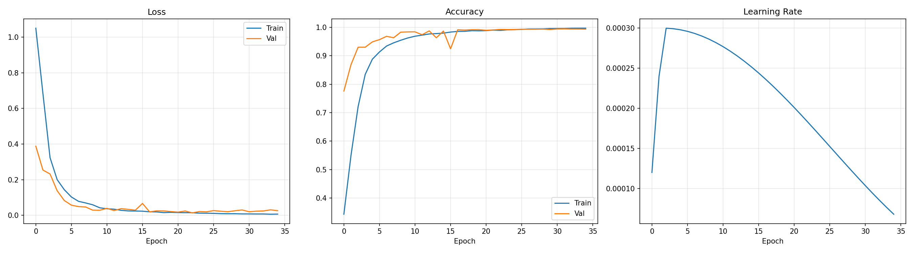

# Machine Listener - Audio Classification 🎧

An end-to-end deep learning pipeline for audio classification, developed as part of the Neural Networks course.

This model successfully achieved **2nd place** in the machine listening evaluation competition! 🥈

---

## 🌐 Live Deployment

Try out the model interactively on Hugging Face Spaces:

👉 [Machine Fault Listener - Live Demo](https://huggingface.co/spaces/ammaryasserF/Machine-Fault-Listener)

---

## 📁 Project Structure

```bash
machine_listener_project/
├── Dockerfile                # Containerization setup for reproducible environments
├── Kaggle.md                 # Documentation for Kaggle environment training
├── infer.py                  # Inference script for predicting on new audio files
├── kaggle_train.py           # Training script optimized for Kaggle notebooks
├── requirements.txt          # Python dependencies
├── models/                   # Saved models and training history
│   ├── best_model.pt         # PyTorch weights for the best-performing model
│   ├── model.onnx            # Exported ONNX model for optimized deployment
│   ├── history.json          # Serialized training history (loss/accuracy logs)
│   └── training_curves.png   # Visualizations of training and validation metrics
└── src/                      # Source code modules
    ├── dataset.py            # PyTorch Dataset definitions and data loaders
    ├── features.py           # Feature extraction (e.g., Mel-Spectrograms, MFCCs)
    ├── model.py              # Neural network architecture design
    ├── preprocess.py         # Audio preprocessing (trimming, padding, resampling)
    └── train.py              # Core training loop, validation, and evaluation logic
```

---

## 🚀 Getting Started

### Prerequisites

Ensure you have **Python 3.8+** installed.

Install the required dependencies using pip:

```bash
pip install -r requirements.txt
```

Alternatively, you can use Docker to run the project in a fully isolated environment:

```bash
docker build -t machine-listener .
docker run -it machine-listener bash
```

---

## 🛠️ Usage

### Training the Model

To train the model from scratch, run:

```bash
python src/train.py
```

If you are training on Kaggle or require Kaggle-specific configurations:

```bash
python kaggle_train.py
```

---

### Inference

To run predictions on a new audio file using the trained ONNX or PyTorch model:

```bash
python infer.py --input path/to/audio/file.wav
```

---

## 🧠 Model & Features

### Feature Extraction

Raw audio waveforms are transformed into rich time-frequency representations such as:

- Mel-Spectrograms
- MFCCs
- Spectrograms

Implemented in:

```bash
src/features.py
```

### Preprocessing

Audio files are standardized through:

- Resampling
- Noise reduction
- Padding / truncation

This ensures uniform input dimensions for the neural network.

Implemented in:

```bash
src/preprocess.py
```

### Model Architecture

The deep learning architecture is defined in:

```bash
src/model.py
```

The model utilizes convolutional neural networks (CNNs) tailored for extracting spatial and temporal audio patterns.

### Deployment

The trained model is exported to `.onnx` format for:

- Faster inference
- Cross-platform compatibility
- Easier deployment

---

## 📊 Results

The model's performance metrics are tracked and stored during training.

Below are the training curves showing the convergence of training and validation loss/accuracy over epochs:



The final model achieved top-tier accuracy, securing **2nd place** in the course competition.

---

## 🎓 Acknowledgment

Developed at Cairo University.
